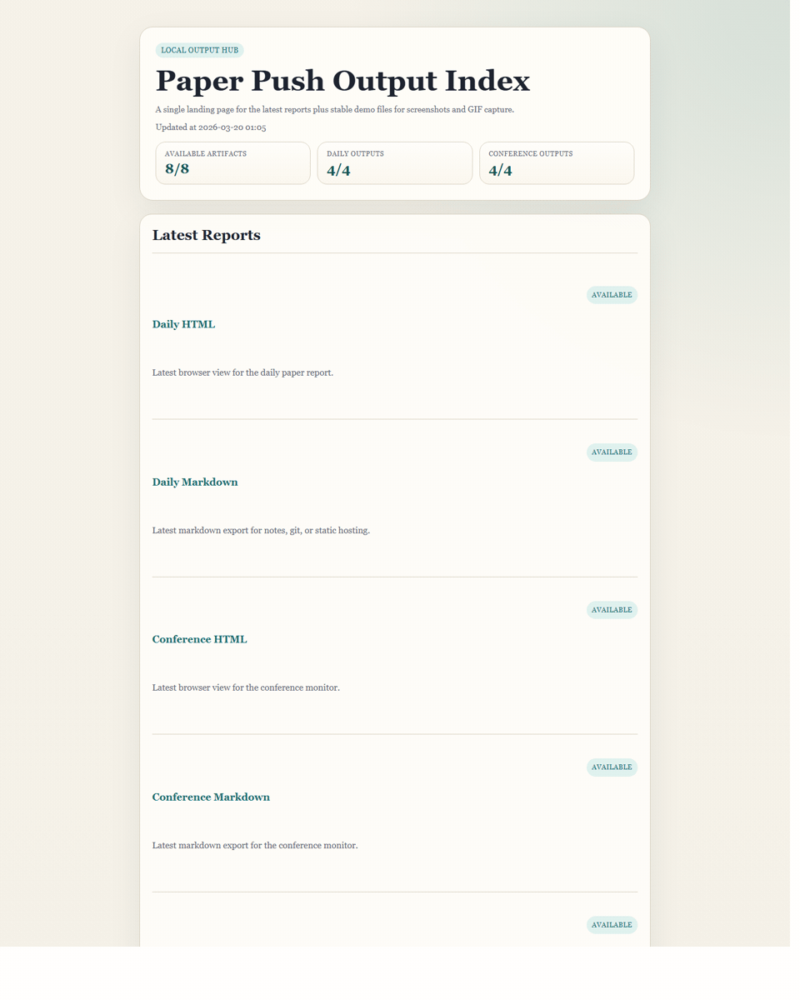
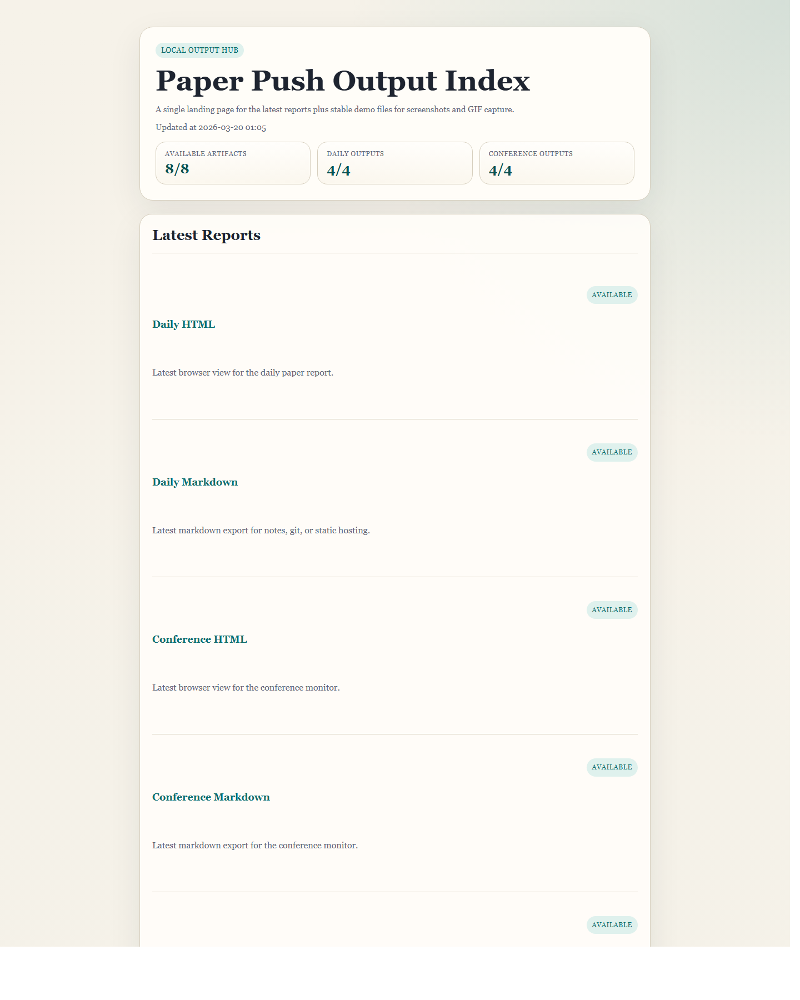
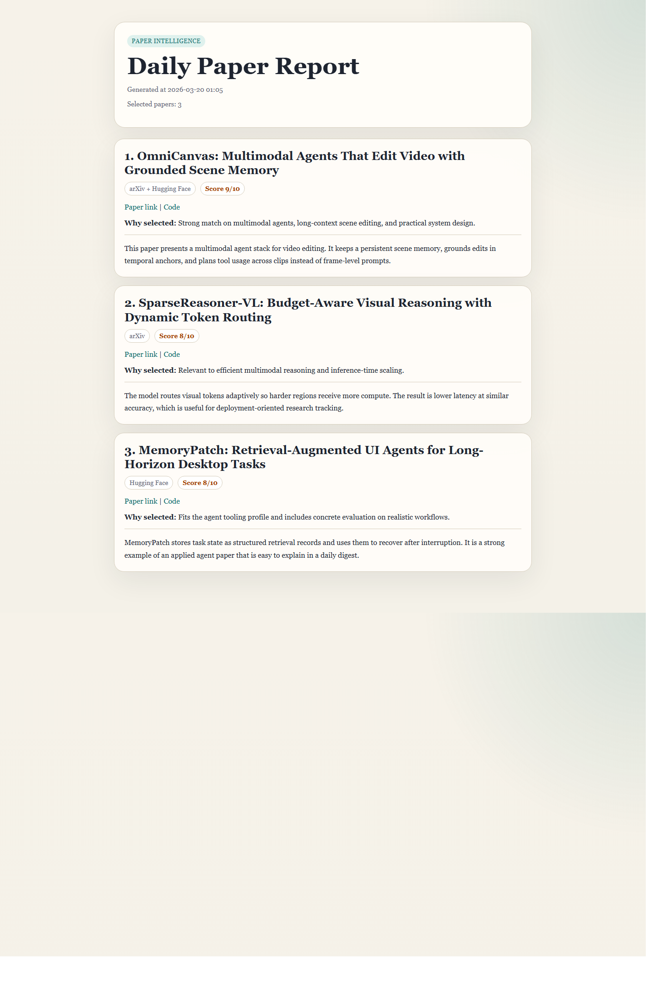
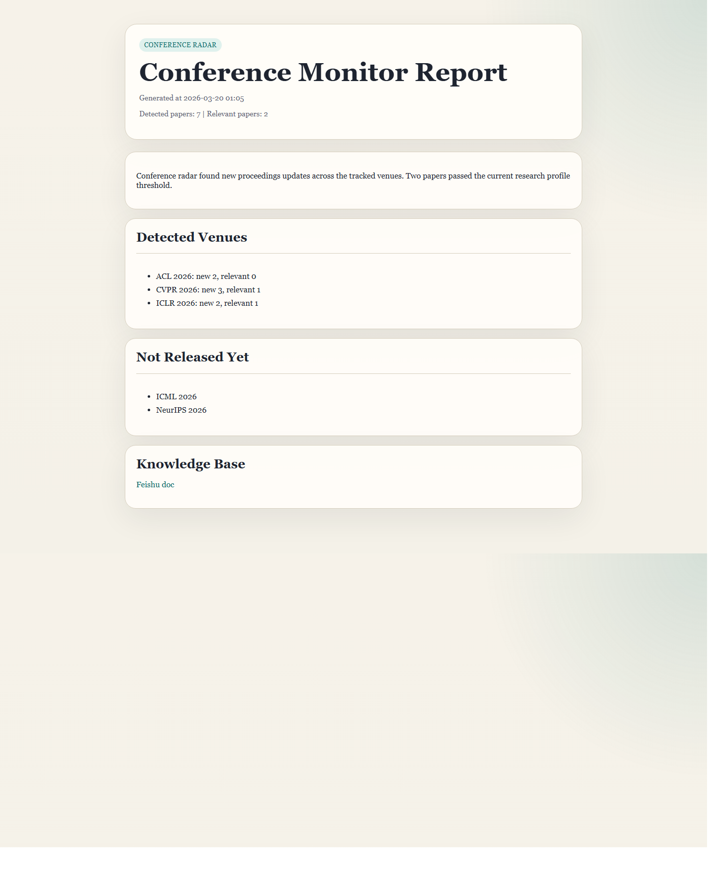

# Paper Push

[English](README.md) | [简体中文](README.zh-CN.md)

`paper_push` 是一个面向研究者和实验室的论文情报系统。

它主要解决三件事：

- 用增量抓取降低漏论文风险
- 持续监控目标会议的论文发布状态
- 把结果输出到本地文件或聊天平台

系统会从 `arXiv` 和 `Hugging Face Daily Papers` 抓取论文，按研究方向过滤，调用 DeepSeek 做相关性评分，生成中文总结，并将结果发布到 Feishu、Telegram、Slack 或本地文件。

## 演示预览



### 截图







## 推送效果

`paper_push` 会生成两类研究更新：

| 类型 | 读者会看到什么 |
| --- | --- |
| 论文日报 | 论文排序、来源、相关性分数、评分理由、中文总结、论文链接，以及可用时的代码链接 |
| 会议雷达 | 新检测到的会议论文、各会议相关论文数量、尚未发布的会议，以及稳定的本地报告链接 |

当前支持的推送目标：

| 目标 | 效果 |
| --- | --- |
| `html` | 适合浏览器打开的报告，以及 `output/index.html` 入口页 |
| `markdown` | 可分享的 `.md` 归档文件和稳定的 `latest` 文件 |
| `feishu` | 群通知卡片、可选的交互选文，以及可选的知识库文档写入 |
| `telegram` | 把日报和会议状态发送到 Telegram 聊天 |
| `slack` | 通过 Slack webhook 发送日报和会议状态 |

## 常用流程

不配置任何凭证，先预览产品效果：

```powershell
.\.venv\Scripts\python.exe main.py demo
```

抓取真实论文，但只生成本地 HTML/Markdown 报告：

```powershell
.\.venv\Scripts\python.exe main.py daily --profile multimodal --dry-run --output markdown --output html
```

把论文日报推送到聊天平台，同时保留本地 HTML 备份：

```powershell
.\.venv\Scripts\python.exe main.py daily --profile multimodal --output feishu --output html
.\.venv\Scripts\python.exe main.py daily --profile multimodal --output telegram --output html
.\.venv\Scripts\python.exe main.py daily --profile multimodal --output slack --output html
```

只运行会议雷达：

```powershell
.\.venv\Scripts\python.exe main.py conference --output html --output feishu
```

## 快速开始

如果你想先生成一套适合截图和录 GIF 的演示产物，不想先配任何 API，直接运行：

```powershell
py -3 -m venv .venv
.\.venv\Scripts\python.exe -m pip install -r requirements.txt
.\.venv\Scripts\python.exe main.py demo
```

这会用内置示例论文和会议数据，在 `output/` 下生成一套适合 README 截图、GIF 录屏和静态展示的本地产物。

如果你接下来想跑真实流程，再执行本地输出路径：

```powershell
copy config.yaml.example config.yaml
.\.venv\Scripts\python.exe main.py daily --dry-run --output markdown --output html
```

运行后会在 `output/` 下生成：

- `daily_latest.md`
- `daily_latest.html`
- `conference_latest.md`
- `conference_latest.html`
- `index.html`

如果你不想先手动写 `research_profile`，可以直接使用内置模板：

```powershell
.\.venv\Scripts\python.exe main.py daily --profile multimodal --dry-run --output markdown --output html
```

当前内置模板：

- `multimodal`
- `vision`
- `nlp`
- `agents`

## 安装

源码安装推荐使用可编辑模式：

```powershell
py -3 -m venv .venv
.\.venv\Scripts\python.exe -m pip install -e .
```

安装后可以继续用源码入口：

```powershell
.\.venv\Scripts\python.exe main.py demo
```

也可以使用命令行脚本：

```powershell
.\.venv\Scripts\paper-push.exe demo
```

macOS 或 Linux 可使用：

```bash
python3 -m venv .venv
./.venv/bin/python -m pip install -e .
./.venv/bin/paper-push demo
```

## 命令行

`main.py` 现在支持子命令：

- `daily`
  运行完整的日报流程，然后执行 conference monitor。
- `conference`
  只运行 conference monitor。
- `demo`
  用内置示例内容生成适合截图的本地产物。

示例：

```powershell
.\.venv\Scripts\python.exe main.py demo
.\.venv\Scripts\python.exe main.py daily --output markdown --output telegram
.\.venv\Scripts\python.exe main.py conference --output html --output slack
py -3 main.py --seed-conference-baseline
```

如果你不写子命令，默认行为仍然是原来的完整日报流程。

## 输出方式

`runtime.outputs` 和 `--output` 当前支持：

- `feishu`
- `markdown`
- `html`
- `telegram`
- `slack`

你可以自由组合，例如本地文件用于检查结果，Telegram/Slack 用于团队推送。

## 亮点功能

conference monitor 是这个项目的独立卖点，不是日报流程顺带做一下。

每次正常运行都会检查配置中的会议是否有新论文，并汇报：

- 当前是否发现新的会议论文
- 哪些会议有新增
- 哪些会议在当前年份窗口里还未发布

如果你想先把当前可见会议论文写入本地基线，而不生成摘要也不推送：

```powershell
py -3 main.py --seed-conference-baseline
```

本地输出模式也会生成专门的 conference 报告，方便直接打开浏览器查看。

## 配置

先复制示例配置：

```powershell
copy config.yaml.example config.yaml
```

如果只跑本地输出，至少需要：

- `llm.api_key`

如果启用 Feishu 输出，还需要：

- `feishu.webhook_url`

如果启用 Feishu 交互选文和知识库写入，还需要：

- `feishu.chat_id`
- `feishu.app_id`
- `feishu.app_secret`
- `feishu.wiki_space_id`
- `feishu.wiki_parent_node`

如果启用 Telegram 或 Slack 输出，还需要：

- `telegram.bot_token`
- `telegram.chat_id`
- `slack.webhook_url`

缺失关键配置时，程序会在启动时直接报错，而不是跑到中途才失败。

## 本地产物

本地 writer 会同时生成归档文件和稳定文件名：

- `daily_report_YYYYMMDD_HHMMSS.md`
- `daily_report_YYYYMMDD_HHMMSS.html`
- `daily_latest.md`
- `daily_latest.html`
- `conference_report_YYYYMMDD_HHMMSS.md`
- `conference_report_YYYYMMDD_HHMMSS.html`
- `conference_latest.md`
- `conference_latest.html`
- `daily_demo.md`
- `daily_demo.html`
- `conference_demo.md`
- `conference_demo.html`
- `index.html`

## 开发

发布改动前建议运行完整测试：

```powershell
.\.venv\Scripts\python.exe -m unittest discover -s tests -p "test_*.py"
```

GitHub Actions 会在 Windows + Python 3.12 上运行同一套测试。
